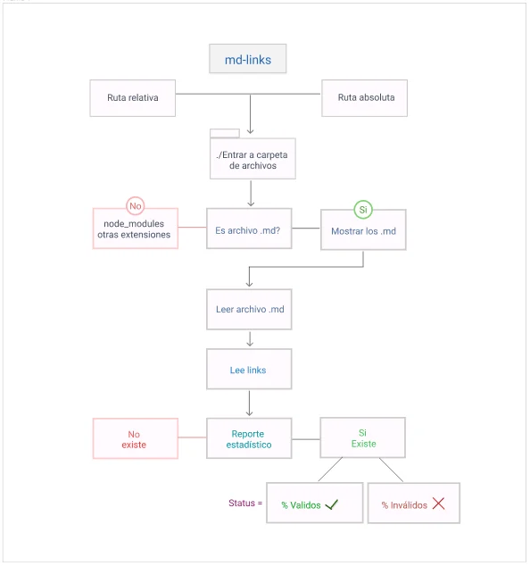

# Markdown Links

## Flujograma mdLinks

https://projects.invisionapp.com/freehand/document/jDGfoWeWv

## Historias de Usuario

| Historias de Usuarios                                                                                                                            | Criterio de Aceptación                                                                                       | Criterios de Terminado                                                                                                                    |
|--------------------------------------------------------------------------------------------------------------------------------------------------|--------------------------------------------------------------------------------------------------------------|-------------------------------------------------------------------------------------------------------------------------------------------|
| **N°1:** Yo como developer, quiero revisar un directorio, pudiendo ingresar a una ruta absoluta o relativa.Y poder revisar el contenido.         | El usuario puede acceder a la carpeta dando o no dando su ubicación, ya sea siendo ésta absoluta o relativa. | El usuario pudo listar todo el directorio de los archivos.                                                                                |
| **N°2:** Yo como usuario quiero poder ver los archivos con extensión .md de la ruta asignada, obteniendo así una lista de éstos.                 | El usuario puede obtener una lista con los archivos .md                                                      | El usuario visualiza la lista filtrada de los archivos markdown.                                                                          |
| **N°3:** Como usuario quiero poder listar los links pertenecientes a los archivos .md dentro de la ruta asignada, para poder acceder a éstos.    | El usuario obtiene una lista de todos los links del archivo seleccionado.                                    | El usuario logra visualizar la lista filtrada de links http dentro del archivo md.                                                        |
| **N°4:** Como usuario quiero obtener un reporte estadístico que me muestre los links válidos y no válidos, y así optimizar el tiempo de trabajo. | La terminal debería desplegar el detalle de los links que funcionan correctamente y así descartar los demás. | El usuario pudo obtener un registro de los links que funcionan correctamente y los que no, pudiendo trabajar de una manera más eficiente. |

## Qué es md-link

Md-Links es una librería creada de node.js y desarrollada bajo el lenguaje JavaScript, con el propósito de leer archivos md y extraer los links que contienen dichos archivos, con esta librería el usuario podrá  encontrar los enlaces, validar su status y visualizar estádisticas respecto al total de links encontrados, validos y no validos.

## Nombre Liberia 

get_my_md_links

https://www.npmjs.com/package/get_my_md_links

## Cómo instalar la librería md-link

## Es necesario tener instalado node.js
   Ejecutar el comando npm install ()
   Posicionarse en el archivo a analizar
   Para ejecutar la libreria debes escribir ruta que se quiere analizar ya sea desde el escritorio o desde una archivo especifico

Autoras: Natalie Echenique / Yosliana Aguilar.
Generación: SCL013-Laboratoria

